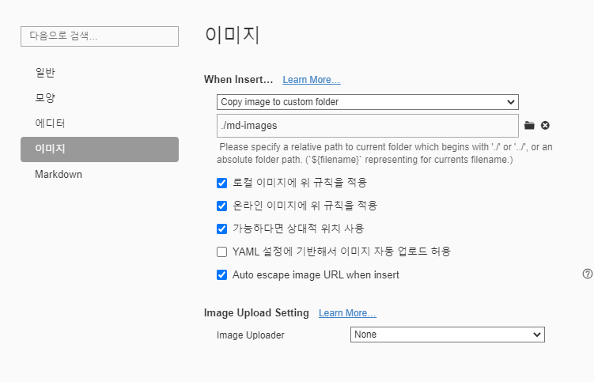

# 마크다운 문법


# 제목(heading)

## heading2
### heading3
#### heading4
##### heading5
`#`으로 제목을 표현할 수 있다.


# 목록

* 순서가 없는목록
* 순서가 없는 목록
  * tab을 하면 하위 레벨
  * 하위레벨에서 나가려면 shift + tab

1. 순서가 있는목록
2. 순사가 있는목록
   1. tab 하위 레벨


# 코드블록

#```html , python

```python
print('hi')

```


# 링크

[구글](https://google.com)

[구글](https://google.com




* d이미지를 상대결로로 자동으로 저장하기 위해서는 위의 타이포라 설정을 참고하면 좋다.


| 순번 | 이름 | 비고 |
| ---- | ---- | ---- |
| 1    |      |      |
| 2    |      |      |
| 3    |      |      |


**굴게(볼드)**

*기울임(이태릭)*

~~취소선~~

---


 